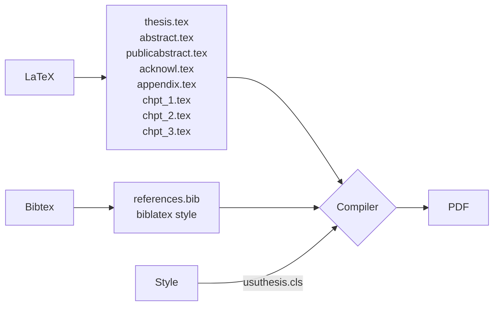

# USU Dissertation|Thesis Template - ReadMe

Last modified: 
    By: Noah Creany
    Date: Sunday, December 3, 2023 At 12:06 pm    
-------

This directory contains the files necessary to create a USU Thesis or Dissertation in according to the Graduate School’s style requirements. The main file that is processed with LaTeX is `thesis.tex`. Please read the comments in the file to see how you can modify the behavior of LaTeX for your specific needs (MS Plan A, Plan B, etc.). LaTeX has a lot of *moving parts*, but the diagram below illustrates how the files and processes interact.

Note that the example document gives several style examples, such as how to reference figures, tables, equations, and other things.  It also shows how to format citations for use in the References section. The latest revision also includes the new requirement for a "public abstract."

Also note the example of how quotes are used in the text, particularly block quotes.  Since the Graduate School requires that block quotes be single-spaced, the kludge found in the example is necessary.

A common problem that students have is that cross-reference, figure, equation, section, and table numbering might get messed up.  Often this is simply because there are old "cache" files in your working directory.  If you have problems, just erase all of the old .aux, .dvi, .toc, etc. files generated by LaTeX or BibTeX and rerun LaTeX.

Finally, the Graduate School requires that figures appear after they are referenced.  To make sure this happens, you should insert the float environment into the text of your document *after* the reference as in:

The image of interest is shown in \ref{fig:myFig}.

\begin{figure}
  .
  .
  \label{fig:myFig}
\end{figure}

This will work with the "flafter" package to guarantee that the float follows the environment call-out.
 
This version of the style includes support for hyperlinks within the document.  The default setting creates links that are black, and allow for direct printing of the document for hard copy binding.  If you would like, you can create the final digital document with hyperlinks that are distinguishable by changing the color of the hyperlinks to blue.

Hints on Graphics:

As you start out on writing your thesis/project/dissertation, put some thought beforehand into creating clean graphics.  The best way to do
so is to create all of your figures directly in encapsulated-postscript (EPS) if you are using dvips and latex, or into PDF if you are using pdflatex.  This is because these are vector graphics types, which means they are scalable and don't become "jaggy" or "pixelated" when enlarged or shrunk.  A second reason is that IEEE usually needs .pdf files for both journal and conference paper submission, and your paper is immediately compatible and of the best graphic quality.  In contrast, a JPEG image can't be enlarged without creating image defects. (You are, of course, interested in submitting
your work to a journal or conference.)

Sometimes you can't conveniently create an .eps or .pdf file (notable case: images).  In that case use either JPEG or PNG.  These can be included and used with pdflatex directly, or converted to EPS using any of the (freely available) conversion tools.

The TikZ-related packages can be used to create good-looking graphics.  At the current time, when run with latex to create a .dvi file, the xdvi viewer will produce incorrect formatting for the TikZ figures.  If the .dvi file is converted to pdf using "dvipdf" the resulting pdf file is correct.  If this example is used with pdflatex, the resulting TikZ figures in the output look fine.

If you find that the style file does not do something and you need to make changes, be sure your changes (after debugging) are uploaded to the repository for this distribution.  Dr. Budge can get you set up to do that.  The same request goes for adding text in the example files to show how the new features you added are used.

What about multiple-paper format?

The Graduate School allows for dissertations with multiple-paper format.  Support is added in the templates to put a list of references at the end of each chapter (paper).  Uncomment the appropriate sections in thesis.tex, chapter_1.tex and chapter_2.tex to use this feature.
